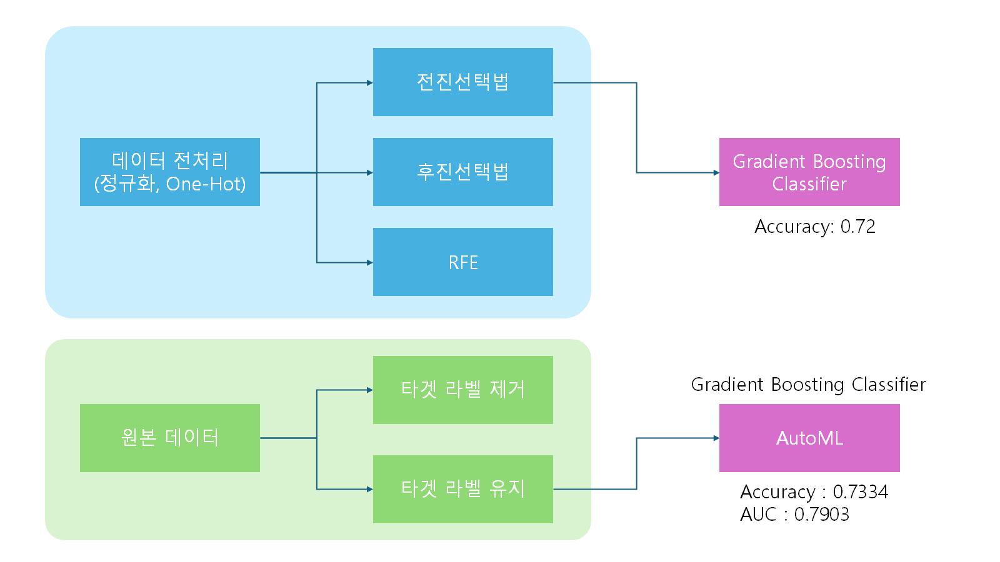

# 1. Test Case



### 1. 전처리 데이터 ML<br>
- 전진선택법
```python

```
- 후진소거법
```python

```
- RFE
```python

```
<br>

### 2. 원본 데이터 ML<br>
- 타겟 라벨 제거
```python
import pycaret
import pandas as pd
import numpy as np

x = pd.DataFrame(feature, columns=['age', 'balance', 'day', 'campaign', 'pdays', 'previous'])
y = pd.DataFrame(target, columns=['deposit'])

bostonDF = x
bostonDF['deposit'] = y
```
- 타겟 라벨 유지
```python
import pycaret
import pandas as pd
import numpy as np

bostonDF_origin = df_bank
```
<br>

# 2. Result

### 1. 전처리 데이터 ML<br>
- RFE


### 2. 원본 데이터 ML<br>
- 타겟 라벨 유지

| Fold | Accuracy | AUC   | Recall | Precision | F1    | Kappa | MCC   |
|------|----------|-------|--------|-----------|-------|-------|-------|
| 0    | 0.8670   | 0.9221| 0.8670 | 0.8686    | 0.8671| 0.7341| 0.7352|
| 1    | 0.8645   | 0.9333| 0.8645 | 0.8653    | 0.8645| 0.7288| 0.7294|
| 2    | 0.8465   | 0.9216| 0.8465 | 0.8499    | 0.8466| 0.6937| 0.6963|
| 3    | 0.8579   | 0.9274| 0.8579 | 0.8598    | 0.8580| 0.7159| 0.7174|
| 4    | 0.8476   | 0.9171| 0.8476 | 0.8501    | 0.8477| 0.6956| 0.6975|
| 5    | 0.8630   | 0.9223| 0.8630 | 0.8640    | 0.8631| 0.7259| 0.7266|
| 6    | 0.8745   | 0.9446| 0.8745 | 0.8748    | 0.8746| 0.7486| 0.7488|
| 7    | 0.8592   | 0.9321| 0.8592 | 0.8610    | 0.8592| 0.7184| 0.7198|
| 8    | 0.8451   | 0.9239| 0.8451 | 0.8476    | 0.8452| 0.6905| 0.6924|
| 9    | 0.8656   | 0.9260| 0.8656 | 0.8695    | 0.8656| 0.7317| 0.7350|
| **Mean** | **0.8591** | **0.9270** | **0.8591** | **0.8611** | **0.8592** | **0.7183** | **0.7198** |
| **Std**  | **0.0093** | **0.0075** | **0.0093** | **0.0088** | **0.0093** | **0.0185** | **0.0180** |

<br>


# 3. parameter tuning
### 1. 원본 데이터 ML<br>
- 타겟 라벨 유지

| Fold | Accuracy | AUC   | Recall | Precision | F1    | Kappa | MCC   |
|------|----------|-------|--------|-----------|-------|-------|-------|
| 0    | 0.8491   | 0.9157| 0.8491 | 0.8504    | 0.8492| 0.6982| 0.6991|
| 1    | 0.8542   | 0.9262| 0.8542 | 0.8555    | 0.8543| 0.7084| 0.7094|
| 2    | 0.8581   | 0.9145| 0.8581 | 0.8603    | 0.8581| 0.7164| 0.7181|
| 3    | 0.8566   | 0.9229| 0.8566 | 0.8577    | 0.8567| 0.7131| 0.7139|
| 4    | 0.8399   | 0.9187| 0.8399 | 0.8424    | 0.8400| 0.6803| 0.6821|
| 5    | 0.8566   | 0.9173| 0.8566 | 0.8575    | 0.8567| 0.7130| 0.7136|
| 6    | 0.8720   | 0.9386| 0.8720 | 0.8720    | 0.8720| 0.7433| 0.7433|
| 7    | 0.8489   | 0.9226| 0.8489 | 0.8502    | 0.8490| 0.6978| 0.6987|
| 8    | 0.8464   | 0.9227| 0.8464 | 0.8487    | 0.8464| 0.6930| 0.6948|
| 9    | 0.8566   | 0.9207| 0.8566 | 0.8587    | 0.8567| 0.7134| 0.7150|
| **Mean** | **0.8538** | **0.9220** | **0.8538** | **0.8553** | **0.8539** | **0.7077** | **0.7088** |
| **Std**  | **0.0082** | **0.0065** | **0.0082** | **0.0076** | **0.0081** | **0.0161** | **0.0157** |
