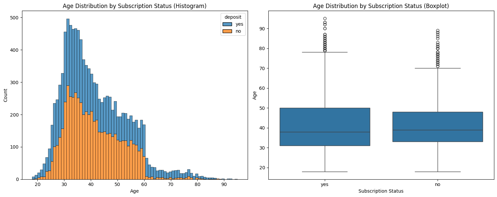
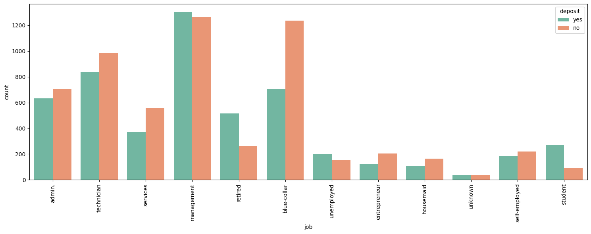
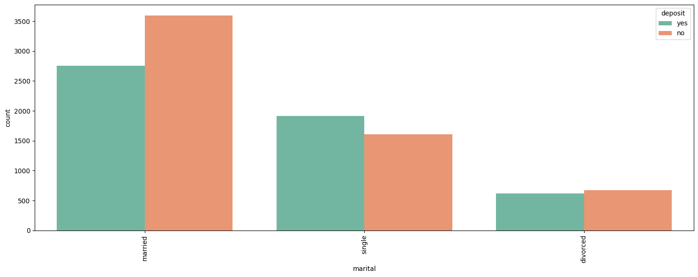
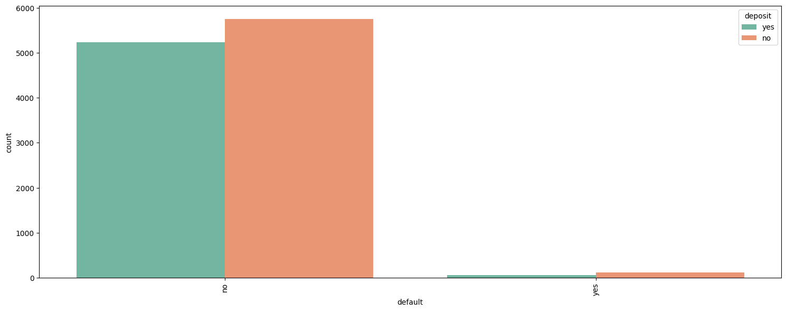
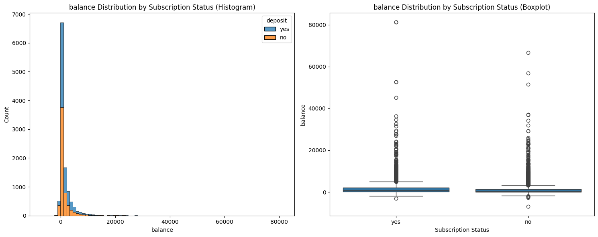

# 1. EDA

### 1. Age


- df.describe() - 고객 연령의 최소값은 18세, 최대값은 95세
- 따라서 각 연령대의 수를 세기 위해서는 bins 인자를 95-18+1로 설정해야 합니다.
- 대부분의 고객은 30~50세 사이에 위치
- 박스플롯에 따르면 70세 이상의 연령은 이상치로 간주됨
- 마지막 히스토그램은 이상치를 제외한 연령에 대한 히스토그램입니다.

### 2. Job


- management 직업군이 가장 많은 수를 차지
- 직업에 대한 "unknown" 카테고리는 결측값으로 간주될 수 있으며, 가장 적은 수를 가지고 있음
- "unknown" 다음으로 "student" 직업 카테고리가 두 번째로 적은 수를 차지
```
직업별 고객 수:
job
management     2566
blue-collar    1944
technician     1823
Name: count, dtype: int64
```

### 3. Marital


- 기혼자가 가장 많은 수를 차지하며, 그다음으로 미혼자와 이혼자가 차례대로 뒤따름

### 4. Default


- 고객이 신용 불이행(default)이 있는지 여부를 나타냄. 대부분의 고객이 신용 불이행이 없음

### 5. Balance


- 이 칼럼은 각 고객의 연간 평균 잔액을 나타냄
- 이 칼럼의 최소값은 -6847, 최대값은 81204, 평균은 약 1529, 표준편차는 3225
- 이러한 통계적 지표들은 이 칼럼이 다양한 값을 가지고 있으며 많은 이상치(outliers)가 존재한다는 것을 보여줍니다.
- 아래 히스토그램과 박스플롯을 통해 값의 빈도를 확인하고 이상치를 찾을 수 있습니다. 마지막 그래프는 박스플롯에서 확인된 이상치를 제외한 잔액 칼럼의 히스토그램입니다.


#### 이상치 경계 서치
```python
balance_data = df["balance"]

Q1 = np.percentile(balance_data, 25)
Q3 = np.percentile(balance_data, 75)

IQR = Q3 - Q1

lower_whisker = Q1 - 1.5 * IQR
upper_whisker = Q3 + 1.5 * IQR
# 이상치 경계 _ ex. -2257 이하, 4087이상의 값들은 모두 이상치로 처리 가능
print("Lower whisker:", lower_whisker)
print("Upper whisker:", upper_whisker)
```
```bash
Lower whisker: -2257.0
Upper whisker: 4087.0
```


# 2. Test Case


### 1. 전처리 데이터 ML<br>
- 전진선택법
```python
import statsmodels.api as sm
from sklearn.model_selection import train_test_split

# 타겟과 피처 분리
X = df_bank_ready.drop('deposit_yes', axis=1)
y = df_bank_ready['deposit_yes']

# 데이터 분할
X_train, X_test, y_train, y_test = train_test_split(X, y, test_size=0.3, random_state=123)

# 전진 선택법 구현
def forward_selection(X, y):
    initial_features = []
    best_features = []

    while len(initial_features) < X.shape[1]:
        remaining_features = [f for f in X.columns if f not in initial_features]
        scores = {}
        for f in remaining_features:
            model = sm.Logit(y, sm.add_constant(X[initial_features + [f]])).fit(disp=0)
            scores[f] = model.aic  # AIC 기준 사용
        best_feature = min(scores, key=scores.get)
        initial_features.append(best_feature)
        best_features.append(best_feature)

    return best_features

# 전진 선택법으로 선택된 피처들
best_features = forward_selection(X_train, y_train)
print("선택된 피처:", best_features)
```
- 후진소거법
```python
def backward_elimination(X, y):
    features = X.columns.tolist()

    while len(features) > 0:
        model = sm.Logit(y, sm.add_constant(X[features])).fit(disp=0)
        p_values = model.pvalues[1:]  # 첫 번째 상수(constant)는 제외
        worst_feature = p_values.idxmax()  # 가장 큰 p-value 가진 변수
        if p_values[worst_feature] > 0.05:  # p-value가 0.05보다 크면 제거
            features.remove(worst_feature)
        else:
            break

    return features

# 후진 제거법으로 선택된 피처들
best_features_backward = backward_elimination(X_train, y_train)
print("선택된 피처:", best_features_backward)
```
- RFE
```python
from sklearn.feature_selection import RFE
from sklearn.ensemble import GradientBoostingClassifier

# 모델 설정
model1 = GradientBoostingClassifier()

# RFE 사용
rfe1 = RFE(model1, n_features_to_select=10)  # 선택할 피처 수
rfe1 = rfe1.fit(X_train, y_train)

# 선택된 피처 확인
print("Selected features:", X_train.columns[rfe1.support_])
```
<br>

### 2. 원본 데이터 ML<br>
- 타겟 라벨 제거
```python
import pycaret
import pandas as pd
import numpy as np

x = pd.DataFrame(feature, columns=['age', 'balance', 'day', 'campaign', 'pdays', 'previous'])
y = pd.DataFrame(target, columns=['deposit'])

bostonDF = x
bostonDF['deposit'] = y
```
- 타겟 라벨 유지
```python
import pycaret
import pandas as pd
import numpy as np

df_bank = df_bank.drop('duration', axis=1)
bostonDF_origin = df_bank
```
<br>

- 타겟 라벨 유지: 모델 비교

| Model      | Description                      | Accuracy | AUC   | Recall | Precision | F1    | Kappa  | MCC    | TT (Sec) |
|------------|----------------------------------|----------|-------|--------|-----------|-------|--------|--------|----------|
| gbc        | Gradient Boosting Classifier     | 0.7334   | 0.7903| 0.7334 | 0.7402    | 0.7293| 0.4597 | 0.4692 | 1.6150   |
| lightgbm   | Light Gradient Boosting Machine  | 0.7289   | 0.7875| 0.7289 | 0.7327    | 0.7260| 0.4518 | 0.4578 | 2.1160   |
| rf         | Random Forest Classifier         | 0.7194   | 0.7784| 0.7194 | 0.7212    | 0.7174| 0.4337 | 0.4373 | 1.5860   |
| xgboost    | Extreme Gradient Boosting        | 0.7157   | 0.7771| 0.7157 | 0.7167    | 0.7141| 0.4267 | 0.4293 | 0.4750   |
| ada        | Ada Boost Classifier             | 0.7137   | 0.7706| 0.7137 | 0.7185    | 0.7097| 0.4201 | 0.4278 | 0.9900   |
| ridge      | Ridge Classifier                 | 0.7009   | 0.7630| 0.7009 | 0.7071    | 0.6957| 0.3934 | 0.4028 | 0.2740   |
| lda        | Linear Discriminant Analysis     | 0.7009   | 0.7630| 0.7009 | 0.7071    | 0.6957| 0.3934 | 0.4029 | 0.2970   |
| lr         | Logistic Regression              | 0.6996   | 0.7612| 0.6996 | 0.7033    | 0.6958| 0.3920 | 0.3984 | 1.9140   |
| et         | Extra Trees Classifier           | 0.6927   | 0.7498| 0.6927 | 0.6928    | 0.6916| 0.3813 | 0.3826 | 1.6220   |
| nb         | Naive Bayes                      | 0.6812   | 0.7441| 0.6812 | 0.6916    | 0.6725| 0.3512 | 0.3660 | 0.3780   |
| qda        | Quadratic Discriminant Analysis  | 0.6629   | 0.7160| 0.6629 | 0.6865    | 0.6493| 0.3149 | 0.3413 | 0.2880   |
| dt         | Decision Tree Classifier         | 0.6299   | 0.6293| 0.6299 | 0.6304    | 0.6299| 0.2584 | 0.2585 | 0.5440   |
| knn        | K Neighbors Classifier           | 0.5815   | 0.6043| 0.5815 | 0.5803    | 0.5796| 0.1568 | 0.1576 | 0.3760   |
| svm        | SVM - Linear Kernel              | 0.5463   | 0.5288| 0.5463 | 0.5535    | 0.4831| 0.0789 | 0.0914 | 0.3200   |
| dummy      | Dummy Classifier                 | 0.5262   | 0.5000| 0.5262 | 0.2769    | 0.3628| 0.0000 | 0.0000 | 0.3340   |


# 2. Result

### 1. 전처리 데이터 ML<br>
- RFE

```bash
Selected features: Index(['age', 'balance', 'day', 'campaign', 'pdays', 'housing_yes',
       'contact_unknown', 'month_mar', 'month_oct', 'poutcome_success'],
      dtype='object')

Accuracy: 0.7020
```


### 2. 원본 데이터 ML<br>
- 타겟 라벨 유지 (Gradient Boosting Classifier)

| Fold | Accuracy | AUC   | Recall | Precision | F1    | Kappa | MCC   |
|------|----------|-------|--------|-----------|-------|-------|-------|
| 0    | 0.7187   | 0.7835| 0.7187 | 0.7240    | 0.7146| 0.4299| 0.4380|
| 1    | 0.7404   | 0.7853| 0.7404 | 0.7480    | 0.7363| 0.4740| 0.4843|
| 2    | 0.7366   | 0.7969| 0.7366 | 0.7438    | 0.7325| 0.4663| 0.4761|
| 3    | 0.7324   | 0.7813| 0.7324 | 0.7382    | 0.7287| 0.4580| 0.4664|
| 4    | 0.7439   | 0.8060| 0.7439 | 0.7510    | 0.7401| 0.4811| 0.4907|
| 5    | 0.7196   | 0.7909| 0.7196 | 0.7260    | 0.7151| 0.4316| 0.4409|
| 6    | 0.7119   | 0.7624| 0.7119 | 0.7239    | 0.7047| 0.4141| 0.4298|
| 7    | 0.7516   | 0.8015| 0.7516 | 0.7581    | 0.7482| 0.4969| 0.5058|
| 8    | 0.7426   | 0.7981| 0.7426 | 0.7494    | 0.7389| 0.4786| 0.4879|
| 9    | 0.7362   | 0.7969| 0.7362 | 0.7392    | 0.7338| 0.4670| 0.4720|
| **Mean** | **0.7334** | **0.7903** | **0.7334** | **0.7402** | **0.7293** | **0.4597** | **0.4692** |
| **Std**  | **0.0121** | **0.0120** | **0.0121** | **0.0115** | **0.0129** | **0.0250** | **0.0240** |


<br>


# 3. parameter tuning
### 1. 원본 데이터 ML<br>
- 타겟 라벨 유지

| Fold | Accuracy | AUC   | Recall | Precision | F1    | Kappa  | MCC    |
|------|----------|-------|--------|-----------|-------|--------|--------|
| 0    | 0.6995   | 0.7772| 0.6995 | 0.7091    | 0.6924| 0.3889 | 0.4025 |
| 1    | 0.7327   | 0.7790| 0.7327 | 0.7436    | 0.7272| 0.4575 | 0.4714 |
| 2    | 0.7263   | 0.7883| 0.7263 | 0.7334    | 0.7219| 0.4454 | 0.4553 |
| 3    | 0.7260   | 0.7757| 0.7260 | 0.7321    | 0.7219| 0.4448 | 0.4537 |
| 4    | 0.7618   | 0.8064| 0.7618 | 0.7703    | 0.7581| 0.5173 | 0.5282 |
| 5    | 0.7350   | 0.7922| 0.7350 | 0.7432    | 0.7304| 0.4624 | 0.4736 |
| 6    | 0.6978   | 0.7613| 0.6978 | 0.7130    | 0.6881| 0.3842 | 0.4038 |
| 7    | 0.7580   | 0.7995| 0.7580 | 0.7665    | 0.7542| 0.5094 | 0.5205 |
| 8    | 0.7426   | 0.7923| 0.7426 | 0.7494    | 0.7389| 0.4786 | 0.4879 |
| 9    | 0.7273   | 0.7850| 0.7273 | 0.7329    | 0.7235| 0.4476 | 0.4558 |
| **Mean** | **0.7307** | **0.7857** | **0.7307** | **0.7394** | **0.7257** | **0.4536** | **0.4653** |
| **Std**  | **0.0200** | **0.0123** | **0.0200** | **0.0189** | **0.0215** | **0.0413** | **0.0396** |

